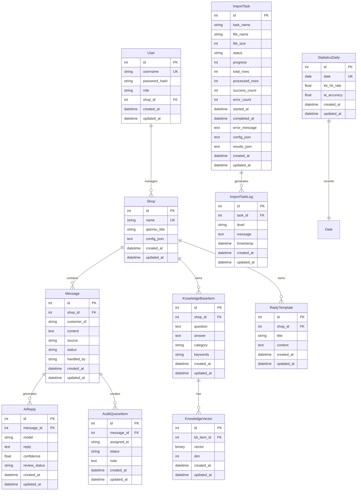

# 智能客服系统数据库设计

## 数据库概述

智能客服系统采用关系型数据库设计，支持SQLite（开发环境）和MySQL（生产环境）。数据库设计遵循第三范式，确保数据一致性和完整性。

## ER图



## 表结构详细说明

### 1. 用户管理表

#### users - 用户表
| 字段名 | 类型 | 约束 | 说明 |
|--------|------|------|------|
| id | INTEGER | PRIMARY KEY | 用户ID |
| username | VARCHAR(64) | UNIQUE, NOT NULL | 用户名 |
| password_hash | VARCHAR(255) | NOT NULL | 密码哈希 |
| role | VARCHAR(32) | NOT NULL, DEFAULT 'agent' | 角色：superadmin/admin/agent |
| shop_id | INTEGER | FOREIGN KEY | 所属店铺ID |
| created_at | DATETIME | NOT NULL | 创建时间 |
| updated_at | DATETIME | NOT NULL | 更新时间 |

**索引**:
- `idx_users_username` ON username
- `idx_users_shop_id` ON shop_id
- `idx_users_role` ON role

### 2. 店铺管理表

#### shops - 店铺表
| 字段名 | 类型 | 约束 | 说明 |
|--------|------|------|------|
| id | INTEGER | PRIMARY KEY | 店铺ID |
| name | VARCHAR(128) | UNIQUE, NOT NULL | 店铺名称 |
| qianniu_title | VARCHAR(256) | NULL | 千牛窗口标题标识 |
| config_json | TEXT | NULL | 店铺配置JSON |
| created_at | DATETIME | NOT NULL | 创建时间 |
| updated_at | DATETIME | NOT NULL | 更新时间 |

**索引**:
- `idx_shops_name` ON name
- `idx_shops_qianniu_title` ON qianniu_title

**配置JSON结构**:
```json
{
  "ocr_region": [800, 200, 600, 300],
  "unread_threshold": 0.02,
  "title_kw": "千牛",
  "auto_mode": false,
  "ai_model": "stub",
  "business_hours": "09:00-18:00",
  "reply_delay": 2,
  "blacklist": ["customer001", "customer002"],
  "whitelist": ["vip001", "vip002"]
}
```

### 3. 消息管理表

#### messages - 消息表
| 字段名 | 类型 | 约束 | 说明 |
|--------|------|------|------|
| id | INTEGER | PRIMARY KEY | 消息ID |
| shop_id | INTEGER | FOREIGN KEY, NOT NULL | 店铺ID |
| customer_id | VARCHAR(128) | NOT NULL | 客户ID |
| content | TEXT | NOT NULL | 消息内容 |
| source | VARCHAR(32) | NOT NULL, DEFAULT 'qianniu' | 消息来源 |
| status | VARCHAR(32) | NOT NULL, DEFAULT 'new' | 状态：new/answered/queued/review |
| handled_by | VARCHAR(64) | NULL | 处理人 |
| created_at | DATETIME | NOT NULL | 创建时间 |
| updated_at | DATETIME | NOT NULL | 更新时间 |

**索引**:
- `idx_messages_shop_id` ON shop_id
- `idx_messages_customer_id` ON customer_id
- `idx_messages_status` ON status
- `idx_messages_created_at` ON created_at
- `idx_messages_shop_status` ON shop_id, status

### 4. 知识库管理表

#### knowledge_base - 知识库条目表
| 字段名 | 类型 | 约束 | 说明 |
|--------|------|------|------|
| id | INTEGER | PRIMARY KEY | 条目ID |
| shop_id | INTEGER | FOREIGN KEY, NULL | 店铺ID（NULL表示全局） |
| question | TEXT | NOT NULL | 问题 |
| answer | TEXT | NOT NULL | 答案 |
| category | VARCHAR(64) | NULL | 分类 |
| keywords | VARCHAR(512) | NULL | 关键词（逗号分隔） |
| created_at | DATETIME | NOT NULL | 创建时间 |
| updated_at | DATETIME | NOT NULL | 更新时间 |

**索引**:
- `idx_kb_shop_id` ON shop_id
- `idx_kb_category` ON category
- `idx_kb_question` ON question(100)

#### knowledge_vectors - 知识库向量表
| 字段名 | 类型 | 约束 | 说明 |
|--------|------|------|------|
| id | INTEGER | PRIMARY KEY | 向量ID |
| kb_item_id | INTEGER | FOREIGN KEY, NOT NULL | 知识库条目ID |
| vector | LONGBLOB | NOT NULL | 向量数据 |
| dim | INTEGER | NOT NULL | 向量维度 |
| created_at | DATETIME | NOT NULL | 创建时间 |
| updated_at | DATETIME | NOT NULL | 更新时间 |

**索引**:
- `idx_kv_kb_item_id` ON kb_item_id

### 5. AI回复管理表

#### ai_replies - AI回复表
| 字段名 | 类型 | 约束 | 说明 |
|--------|------|------|------|
| id | INTEGER | PRIMARY KEY | 回复ID |
| message_id | INTEGER | FOREIGN KEY, NOT NULL | 消息ID |
| model | VARCHAR(64) | NOT NULL | AI模型 |
| reply | TEXT | NOT NULL | 回复内容 |
| confidence | FLOAT | NULL | 置信度 |
| review_status | VARCHAR(32) | NOT NULL, DEFAULT 'auto' | 审核状态：auto/pending/approved/rejected |
| created_at | DATETIME | NOT NULL | 创建时间 |
| updated_at | DATETIME | NOT NULL | 更新时间 |

**索引**:
- `idx_ai_replies_message_id` ON message_id
- `idx_ai_replies_review_status` ON review_status
- `idx_ai_replies_model` ON model

### 6. 回复模板表

#### reply_templates - 回复模板表
| 字段名 | 类型 | 约束 | 说明 |
|--------|------|------|------|
| id | INTEGER | PRIMARY KEY | 模板ID |
| shop_id | INTEGER | FOREIGN KEY, NULL | 店铺ID（NULL表示全局） |
| title | VARCHAR(128) | NOT NULL | 模板标题 |
| content | TEXT | NOT NULL | 模板内容 |
| created_at | DATETIME | NOT NULL | 创建时间 |
| updated_at | DATETIME | NOT NULL | 更新时间 |

**索引**:
- `idx_templates_shop_id` ON shop_id

### 7. 审核队列表

#### audit_queue - 审核队列表
| 字段名 | 类型 | 约束 | 说明 |
|--------|------|------|------|
| id | INTEGER | PRIMARY KEY | 审核项ID |
| message_id | INTEGER | FOREIGN KEY, NOT NULL | 消息ID |
| assigned_to | VARCHAR(64) | NULL | 分配给谁 |
| status | VARCHAR(32) | NOT NULL, DEFAULT 'pending' | 状态：pending/approved/rejected |
| note | TEXT | NULL | 备注 |
| created_at | DATETIME | NOT NULL | 创建时间 |
| updated_at | DATETIME | NOT NULL | 更新时间 |

**索引**:
- `idx_audit_message_id` ON message_id
- `idx_audit_status` ON status
- `idx_audit_assigned_to` ON assigned_to

### 8. 统计报表表

#### statistics_daily - 每日统计表
| 字段名 | 类型 | 约束 | 说明 |
|--------|------|------|------|
| id | INTEGER | PRIMARY KEY | 统计ID |
| date | DATE | UNIQUE, NOT NULL | 统计日期 |
| kb_hit_rate | FLOAT | NULL | 知识库命中率 |
| ai_accuracy | FLOAT | NULL | AI准确率 |
| created_at | DATETIME | NOT NULL | 创建时间 |
| updated_at | DATETIME | NOT NULL | 更新时间 |

**索引**:
- `idx_stats_date` ON date

### 9. 导入任务表

#### import_tasks - 导入任务表
| 字段名 | 类型 | 约束 | 说明 |
|--------|------|------|------|
| id | INTEGER | PRIMARY KEY | 任务ID |
| task_name | VARCHAR(255) | NOT NULL | 任务名称 |
| file_name | VARCHAR(255) | NOT NULL | 文件名 |
| file_size | INTEGER | NULL | 文件大小 |
| status | VARCHAR(50) | NOT NULL, DEFAULT 'pending' | 状态：pending/processing/completed/failed/cancelled |
| progress | INTEGER | NOT NULL, DEFAULT 0 | 进度百分比 |
| total_rows | INTEGER | NULL | 总行数 |
| processed_rows | INTEGER | NOT NULL, DEFAULT 0 | 已处理行数 |
| success_count | INTEGER | NOT NULL, DEFAULT 0 | 成功数量 |
| error_count | INTEGER | NOT NULL, DEFAULT 0 | 错误数量 |
| started_at | DATETIME | NULL | 开始时间 |
| completed_at | DATETIME | NULL | 完成时间 |
| error_message | TEXT | NULL | 错误信息 |
| config_json | TEXT | NULL | 导入配置 |
| results_json | TEXT | NULL | 处理结果 |
| created_at | DATETIME | NOT NULL | 创建时间 |
| updated_at | DATETIME | NOT NULL | 更新时间 |

**索引**:
- `idx_import_tasks_status` ON status
- `idx_import_tasks_created_at` ON created_at

#### import_task_logs - 导入任务日志表
| 字段名 | 类型 | 约束 | 说明 |
|--------|------|------|------|
| id | INTEGER | PRIMARY KEY | 日志ID |
| task_id | INTEGER | FOREIGN KEY, NOT NULL | 任务ID |
| level | VARCHAR(20) | NOT NULL | 日志级别：info/warning/error |
| message | TEXT | NOT NULL | 日志消息 |
| timestamp | DATETIME | NOT NULL | 时间戳 |
| created_at | DATETIME | NOT NULL | 创建时间 |
| updated_at | DATETIME | NOT NULL | 更新时间 |

**索引**:
- `idx_import_logs_task_id` ON task_id
- `idx_import_logs_level` ON level
- `idx_import_logs_timestamp` ON timestamp

## 连接池与健康检查

### 连接池配置

为提升数据库访问性能与稳定性，生产环境建议启用SQLAlchemy连接池：

```python
SQLALCHEMY_ENGINE_OPTIONS = {
    'pool_pre_ping': True,   # 探测连接可用性，避免使用失效连接
    'pool_recycle': 300,     # 回收时间(秒)，避免长连接被中间件断开
    'pool_size': 10,         # 常驻连接数
    'max_overflow': 20       # 峰值时的额外连接数
}
```

结合 `houduan/utils/connection_pool.py` 可输出连接池健康报告，为容量规划与故障定位提供依据。

### 健康检查机制

系统提供多层级健康检查：

- SQL探测：执行 `SELECT 1` 验证数据库可用性
- 运行期监控：`houduan/services/db_health.py` 周期性采集连接数、失败率等指标
- 对外接口：`GET /health` 汇总数据库/OCR/AI/调度器等服务状态

`/health` 与数据库相关的关键字段示例：

```json
{
  "services": { "database": "ok" },
  "db_health": { "status": "healthy", "metrics": { /* pool与错误率 */ } },
  "performance": {
    "connection_pool": { /* 池大小、空闲、活动、等待 */ },
    "query_performance": { /* 慢查询、平均耗时 */ }
  }
}
```

## 数据字典

### 枚举值说明

#### 用户角色 (role)
- `superadmin`: 超级管理员，可管理所有店铺和用户
- `admin`: 店铺管理员，可管理所属店铺
- `agent`: 客服代理，只能处理消息和审核

#### 消息状态 (status)
- `new`: 新消息，未处理
- `answered`: 已回复
- `queued`: 排队中
- `review`: 待审核

#### 审核状态 (review_status)
- `auto`: 自动通过
- `pending`: 待审核
- `approved`: 已通过
- `rejected`: 已拒绝

#### 任务状态 (status)
- `pending`: 待处理
- `processing`: 处理中
- `completed`: 已完成
- `failed`: 失败
- `cancelled`: 已取消

## 索引策略

### 主要索引

1. **主键索引**: 所有表都有自增主键
2. **唯一索引**: username, shop_name, date等
3. **外键索引**: 所有外键字段
4. **查询索引**: 常用查询字段组合

### 复合索引

```sql
-- 消息查询优化
CREATE INDEX idx_messages_shop_status ON messages(shop_id, status);
CREATE INDEX idx_messages_shop_created ON messages(shop_id, created_at);

-- 知识库查询优化
CREATE INDEX idx_kb_shop_category ON knowledge_base(shop_id, category);

-- 审核队列优化
CREATE INDEX idx_audit_status_assigned ON audit_queue(status, assigned_to);
```

## 数据库优化建议

### 1. 查询优化

#### 常用查询模式
```sql
-- 按店铺查询消息
SELECT * FROM messages WHERE shop_id = ? AND status = 'new' ORDER BY created_at DESC;

-- 知识库搜索
SELECT * FROM knowledge_base WHERE shop_id = ? AND category = ?;

-- 审核队列查询
SELECT * FROM audit_queue WHERE status = 'pending' ORDER BY created_at ASC;
```

#### 优化建议
- 使用LIMIT限制结果集大小
- 避免SELECT *，只查询需要的字段
- 合理使用JOIN，避免N+1查询
- 使用EXPLAIN分析查询计划

### 2. 存储优化

#### 数据清理策略
```sql
-- 清理过期消息（保留30天）
DELETE FROM messages WHERE created_at < DATE_SUB(NOW(), INTERVAL 30 DAY);

-- 清理完成的导入任务（保留7天）
DELETE FROM import_tasks WHERE status = 'completed' AND completed_at < DATE_SUB(NOW(), INTERVAL 7 DAY);
```

#### 分区策略
- 按时间分区：messages表按月分区
- 按店铺分区：大型部署可考虑按shop_id分区

### 3. 性能监控

#### 关键指标
- 查询响应时间
- 索引使用率
- 锁等待时间
- 连接数使用率

#### 监控SQL
```sql
-- 查看慢查询
SHOW VARIABLES LIKE 'slow_query_log';
SHOW VARIABLES LIKE 'long_query_time';

-- 查看索引使用情况
SHOW INDEX FROM messages;

-- 查看表大小
SELECT 
    table_name,
    ROUND(((data_length + index_length) / 1024 / 1024), 2) AS 'Size (MB)'
FROM information_schema.tables
WHERE table_schema = 'smart_cs'
ORDER BY (data_length + index_length) DESC;
```

## 迁移历史

### 版本 1.0 - 初始版本
- 创建基础表结构
- 用户、店铺、消息、知识库等核心表

### 版本 1.1 - 功能增强
- 添加向量索引表
- 添加AI回复表
- 添加审核队列表

### 版本 1.2 - 统计功能
- 添加统计报表表
- 添加导入任务表
- 优化索引结构

## 备份与恢复

### 备份策略
```bash
# MySQL备份
mysqldump -u username -p smart_cs > backup_$(date +%Y%m%d_%H%M%S).sql

# SQLite备份
cp data/sqlite.db backup/sqlite_$(date +%Y%m%d_%H%M%S).db
```

### 恢复策略
```bash
# MySQL恢复
mysql -u username -p smart_cs < backup_file.sql

# SQLite恢复
cp backup/sqlite_backup.db data/sqlite.db
```

---

**文档版本**: v2.0  
**最后更新**: 2025-10-22  
**维护人员**: 数据库团队
