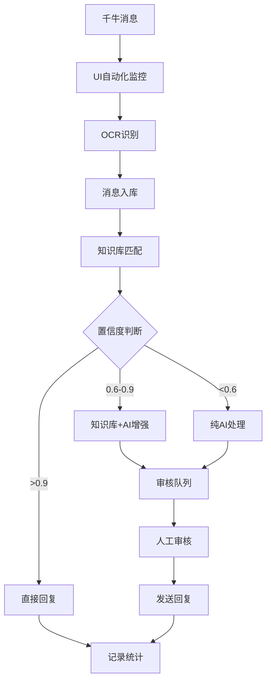
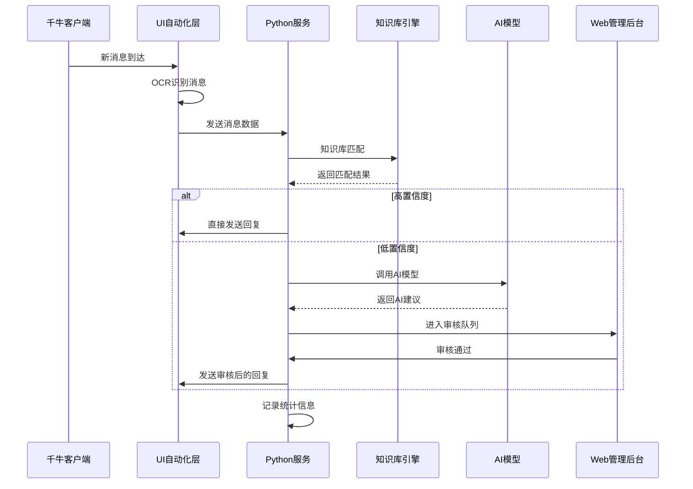

# 智能客服系统架构设计

## 系统概述

智能客服系统是一个基于UI自动化的淘宝千牛客服自动回复系统，采用四层架构设计，实现从消息监控到智能回复的完整自动化流程。

## 整体架构

### 四层架构设计

```
┌─────────────┐      ┌──────────────┐      ┌─────────────┐
│  千牛客户端  │ ←──→ │  UI自动化层   │ ←──→ │  知识库引擎  │
│  (消息源)   │      │(消息监控/发送)│      │  (智能匹配)  │
└─────────────┘      └──────────────┘      └─────────────┘
                            ↕                      ↕
                     ┌──────────────┐      ┌─────────────┐
                     │  Python服务   │ ←──→ │ AI大模型API │
                     │  (核心逻辑)   │      │  (智能回复)  │
                     └──────────────┘      └─────────────┘
                            ↕
                     ┌──────────────┐
                     │  Web管理后台  │
                     │(审核/配置/知识库)│
                     └──────────────┘
```

### 架构层次说明

#### 1. UI自动化层
- **职责**: 监控千牛工作台消息，OCR识别，自动发送回复
- **技术栈**: pyautogui + pywin32 + PaddleOCR
- **核心功能**:
  - 千牛窗口定位与激活
  - 消息内容OCR识别
  - 自动发送回复消息
  - 多店铺窗口轮询

#### 2. 知识库引擎
- **职责**: 向量检索+语义匹配，智能问答
- **技术栈**: Sentence-Transformers + Faiss + scikit-learn
- **核心功能**:
  - 向量化知识库条目
  - 语义相似度计算
  - 置信度评估
  - 知识库管理

#### 3. Python服务层
- **职责**: Flask后端，处理业务逻辑
- **技术栈**: Flask 3.0 + SQLAlchemy 2.0 + APScheduler
- **核心功能**:
  - API接口服务
  - 数据模型管理
  - 任务调度
  - 业务逻辑处理

#### 4. Web管理后台
- **职责**: Vue 3前端，管理配置和审核
- **技术栈**: Vue 3 + Element Plus + Vite
- **核心功能**:
  - 用户界面管理
  - 配置管理
  - 审核队列
  - 数据统计

## 技术选型

### 后端技术栈

| 技术 | 版本 | 用途 | 选型理由 |
|------|------|------|----------|
| Python | 3.12+ | 主要开发语言 | 生态丰富，AI库支持好 |
| Flask | 3.0 | Web框架 | 轻量级，灵活，适合快速开发 |
| SQLAlchemy | 2.0 | ORM框架 | 功能强大，支持多种数据库 |
| SQLite | 3.x | 开发数据库 | 轻量级，无需安装配置 |
| MySQL | 8.0+ | 生产数据库 | 性能好，支持高并发 |
| APScheduler | 3.10+ | 任务调度 | 支持多种调度策略 |
| PaddleOCR | 2.7+ | OCR识别 | 中文识别效果好 |
| pyautogui | 0.9+ | UI自动化 | 跨平台UI操作 |
| pywin32 | 306+ | Windows API | Windows系统集成 |

### 前端技术栈

| 技术 | 版本 | 用途 | 选型理由 |
|------|------|------|----------|
| Vue | 3.5+ | 前端框架 | 组合式API，性能好 |
| Element Plus | 2.8+ | UI组件库 | 组件丰富，设计统一 |
| Vite | 5.4+ | 构建工具 | 构建速度快，热更新 |
| Pinia | 2.2+ | 状态管理 | Vue 3官方推荐 |
| Vue Router | 4.4+ | 路由管理 | 官方路由解决方案 |
| Axios | 1.7+ | HTTP客户端 | 功能强大，易用性好 |
| ECharts | 6.0+ | 图表库 | 图表类型丰富 |

### AI模型支持

| 模型 | 提供商 | 特点 | 适用场景 |
|------|--------|------|----------|
| OpenAI GPT | OpenAI | 通用性强，效果好 | 高质量回复 |
| 通义千问 | 阿里云 | 中文优化，成本低 | 中文客服场景 |
| 文心一言 | 百度 | 中文理解好 | 本土化应用 |
| 智谱GLM | 智谱AI | 开源可部署 | 私有化部署 |

## 模块划分

### 后端模块结构

```
houduan/
├── app.py                  # Flask应用入口
├── config.py              # 配置管理
├── models/                 # 数据模型层
│   └── __init__.py        # 模型定义
├── api/                    # API接口层
│   ├── auth.py            # 认证接口
│   ├── shops.py           # 店铺管理
│   ├── messages.py        # 消息处理
│   ├── kb.py              # 知识库管理
│   ├── audit.py           # 审核队列
│   └── simple/            # 简化版API
├── services/              # 业务逻辑层
│   ├── qianniu_monitor.py # 千牛监控
│   ├── ai_adapter.py      # AI适配器
│   ├── message_handler.py # 消息处理
│   ├── knowledge_base.py  # 知识库服务
│   └── scheduler.py       # 任务调度
└── utils/                 # 工具函数层
    ├── db_manager.py      # 数据库管理
    ├── cache_manager.py   # 缓存管理
    └── security.py        # 安全工具
```

### 前端模块结构

```
qianduan/src/
├── main.ts                 # 应用入口
├── App.vue                 # 根组件
├── router.ts              # 路由配置
├── api/                   # API客户端
│   └── http.ts            # HTTP配置
├── store/                  # 状态管理
│   └── auth.ts            # 认证状态
├── views/                 # 页面组件
│   ├── Login.vue          # 登录页
│   ├── Shops.vue          # 店铺管理
│   ├── Messages.vue       # 消息管理
│   ├── Audit.vue          # 审核队列
│   ├── KnowledgeBase.vue  # 知识库管理
│   ├── Statistics.vue     # 统计报表
│   └── Users.vue          # 用户管理
├── components/            # 通用组件
└── styles/                # 样式文件
    └── global.css         # 全局样式
```

## 数据流设计

### 消息处理流程



### 系统交互流程



## 关键设计决策

### 1. 架构设计决策

#### 选择四层架构
- **原因**: 职责分离，便于维护和扩展
- **优势**: 每层专注特定功能，降低耦合度
- **考虑**: 层间通信开销，通过合理设计最小化

#### 选择UI自动化方案
- **原因**: 千牛没有开放API，只能通过UI自动化
- **优势**: 无需千牛官方支持，通用性强
- **风险**: 界面变化可能导致失效，需要容错机制

### 2. 技术选型决策

#### 选择Flask而非Django
- **原因**: 项目规模适中，Flask更轻量
- **优势**: 学习成本低，部署简单
- **考虑**: 功能扩展时可能需要更多配置

#### 选择SQLite+MySQL双数据库
- **原因**: 开发用SQLite，生产用MySQL
- **优势**: 开发简单，生产性能好
- **考虑**: 数据迁移和兼容性

#### 选择Vue 3而非React
- **原因**: 团队熟悉度，生态成熟度
- **优势**: 组合式API，性能好
- **考虑**: 学习曲线，长期维护

### 3. 数据设计决策

#### 选择向量检索+关键词匹配
- **原因**: 兼顾准确性和性能
- **优势**: 向量检索语义理解好，关键词匹配速度快
- **考虑**: 向量化成本，存储空间

#### 选择混合审核机制
- **原因**: 平衡自动化程度和回复质量
- **优势**: 高置信度自动处理，低置信度人工审核
- **考虑**: 审核效率，人工成本

## 扩展性设计

### 1. 水平扩展

#### 多实例部署
- 支持多个后端实例
- 负载均衡配置
- 数据库连接池管理

#### 微服务拆分
- 消息处理服务
- 知识库服务
- AI模型服务
- 审核服务

### 2. 功能扩展

#### 多平台支持
- 支持其他电商平台
- 统一的消息处理接口
- 平台适配器模式

#### AI模型扩展
- 插件化AI模型接入
- 模型效果评估
- 自动模型选择

### 3. 性能扩展

#### 缓存策略
- Redis缓存热点数据
- 知识库向量缓存
- API响应缓存

#### 异步处理
- 消息队列处理
- 异步AI调用
- 批量操作优化

## 安全设计

### 1. 数据安全
- 密码加密存储
- 敏感数据加密
- 数据库访问控制

### 2. 接口安全
- JWT认证机制
- API限流控制
- HTTPS传输加密

### 3. 系统安全
- 防火墙配置
- 定期安全更新
- 访问日志审计

## 监控设计

### 1. 系统监控
- 服务健康检查
- 资源使用监控
- 性能指标统计

### 2. 业务监控
- 消息处理统计
- 回复质量评估
- 用户行为分析

### 3. 告警机制
- 邮件告警
- Webhook通知
- 短信告警（可选）

---

**文档版本**: v1.0  
**最后更新**: 2025-01-21  
**维护人员**: 架构团队
